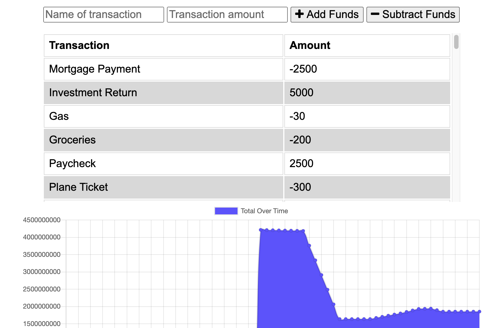

# Budget Tracker PWA

​
#### Created On: 09/22/2020  

  
​
## Creators
Matt Wieciech  
[wheaties5588](https://github.com/wheaties5588)

## Description
This app utilizes mongoDB, express and indexDB to allow the user to track budget information both online and offline. The user can download the application and use it while not connected to the database, and when reconnecting the information will be automatically uploaded to the database.
## Table of Contents
* [Installation](#installation)
* [Usage](#usage)
* [License](#license)
* [Questions](#questions)

## Installation
1. Download repo
2. run 'npm install'
3. run 'npm run webpack'
4. run 'npm start'

## Usage
A user can unter budget information both online and offline and have all of their information be saved.

## License
This project is convered under the MIT License.

## Questions
For questions about this project, please see my GitHub at [wheaties5588](https://github.com/wheaties5588), or reach out by email at matt.wieciech@gmail.com.